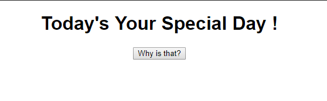
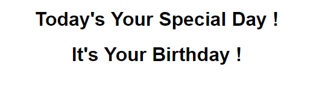

# AJAX - Birthday

Just Vanila JS with html & css

1. **Screenshot 1**

2. **Screenshot 2**

Thanks with tutorial : https://openclassrooms.com/en/courses/3523261-use-javascript-in-your-web-projects/3759261-make-your-first-ajax-request